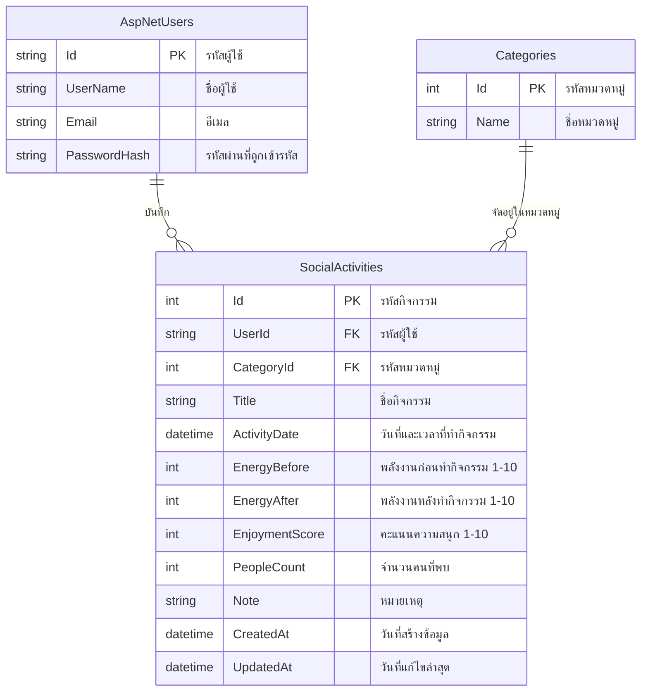

# SocialCharge ER Diagram

```mermaid
erDiagram
    AspNetUsers ||--o{ SocialActivities : "บันทึก"
    Categories ||--o{ SocialActivities : "จัดอยู่ในหมวดหมู่"

    AspNetUsers {
        string Id PK "รหัสผู้ใช้"
        string UserName "ชื่อผู้ใช้"
        string Email "อีเมล"
        string PasswordHash "รหัสผ่านที่ถูกเข้ารหัส"
    }

    SocialActivities {
        int Id PK "รหัสกิจกรรม"
        string UserId FK "รหัสผู้ใช้"
        int CategoryId FK "รหัสหมวดหมู่"
        string Title "ชื่อกิจกรรม"
        datetime ActivityDate "วันที่และเวลาที่ทำกิจกรรม"
        int EnergyBefore "พลังงานก่อนทำกิจกรรม 1-10"
        int EnergyAfter "พลังงานหลังทำกิจกรรม 1-10"
        int EnjoymentScore "คะแนนความสนุก 1-10"
        int PeopleCount "จำนวนคนที่พบ"
        string Note "หมายเหตุ"
        datetime CreatedAt "วันที่สร้างข้อมูล"
        datetime UpdatedAt "วันที่แก้ไขล่าสุด"
    }

    Categories {
        int Id PK "รหัสหมวดหมู่"
        string Name "ชื่อหมวดหมู่"
    }
```